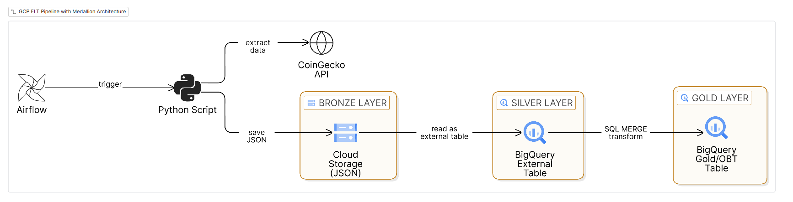

# Crypto Market Data ETL Pipeline

## Overview

This project is an end-to-end Data Engineering pipeline designed to extract, transform, and load (ETL) cryptocurrency market data. It consumes data from the CoinGecko API, processes the raw information, and stores it in Google BigQuery following the **Medallion Architecture**.

The primary goal is to build a reliable, structured history of market metrics (price, volume, market cap) for Business Intelligence (BI) and Data Science applications.

## Architecture

The pipeline is built using **Python** and **Google Cloud Platform (GCP)** services, ensuring scalability and clear separation of concerns.

<p align="center">

</p>

### Data Flow:

1. **Extract (Bronze):** Collects raw JSON data from the API with a robust backoff strategy and stores it in Google Cloud Storage (Bronze Bucket).
2. **Transform (Silver):** Creates a BigQuery **External Table** mapping the GCS blobs. This allows SQL access to raw data without duplicating storage costs.
3. **Load (Gold):** Executes dynamic **SQL MERGE** scripts to consolidate transformed data into a native BigQuery table (One Big Table - OBT), ensuring data uniqueness (Upsert).

---

## Tech Stack

* **Language:** Python 3.10+
* **Cloud Provider:** Google Cloud Platform (GCP)
* **Data Lake:** Google Cloud Storage (GCS)
* **Data Warehouse:** Google BigQuery
* **Orchestration:** Prepared for Apache Airflow
* **Logging:** RotatingFileHandler for execution tracking

---

## Module Details

### 1. Execution Entry Point (`main.py`)

Centralizes the pipeline execution. It uses a `target_date` parameter to ensure **idempotency**, allowing for easy re-processing of specific dates (Backfill).

### 2. Extraction Layer (`extract.py`)

* **Resiliency:** Implements `HTTPAdapter` with a `Retry` strategy to handle API Rate Limits (429 errors) and server instabilities.
* **Partitioning:** Data is saved in GCS using logical date partitioning: `bronze/YYYY-MM-DD/`.

### 3. Loading Layer (`load.py`)

* **Dynamic Execution:** Reads external `.sql` files and injects environment variables (Project ID, Datasets) at runtime.
* **Merge Logic:** Uses the Silver layer as a source to update the Gold native table.

---

## How to Run

### Installation

1. Clone the repository:
```bash
git clone https://github.com/your-user/crypto-api-to-bigquery-etl.git
cd crypto-api-to-bigquery-etl
```


2. Install dependencies:
```bash
pip install -r requirements.txt
```


### Configuration

Create a `.env` file in the root directory:

```env
API_KEY=your_coingecko_key
GCP_PROJECT_ID=your_gcp_project
GOOGLE_APPLICATION_CREDENTIALS=path/to/your/service-account.json
```

### Execution

Run the main script:

```bash
python main.py
```

*Logs will be generated in the `/logs` folder with automatic rotation.*


## Roadmap

* [ ] Implement full orchestration with **Apache Airflow**.
* [ ] Add **Terraform** scripts for infrastructure provisioning.
* [ ] Implement Data Quality checks with **Great Expectations**.
